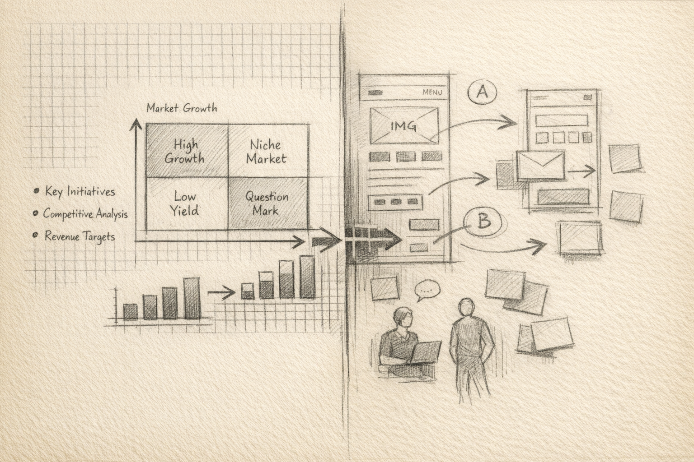
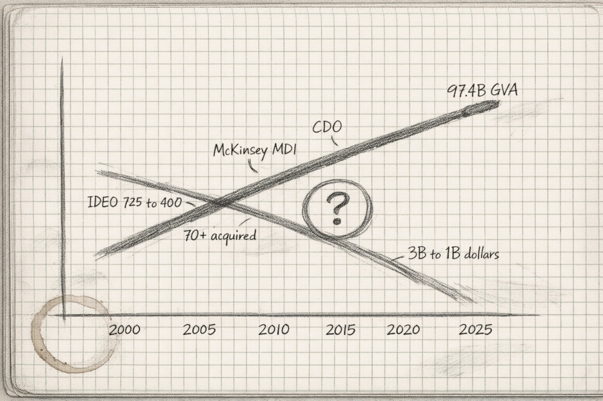
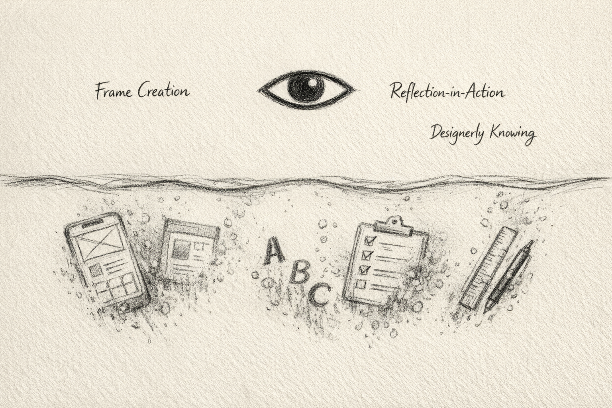
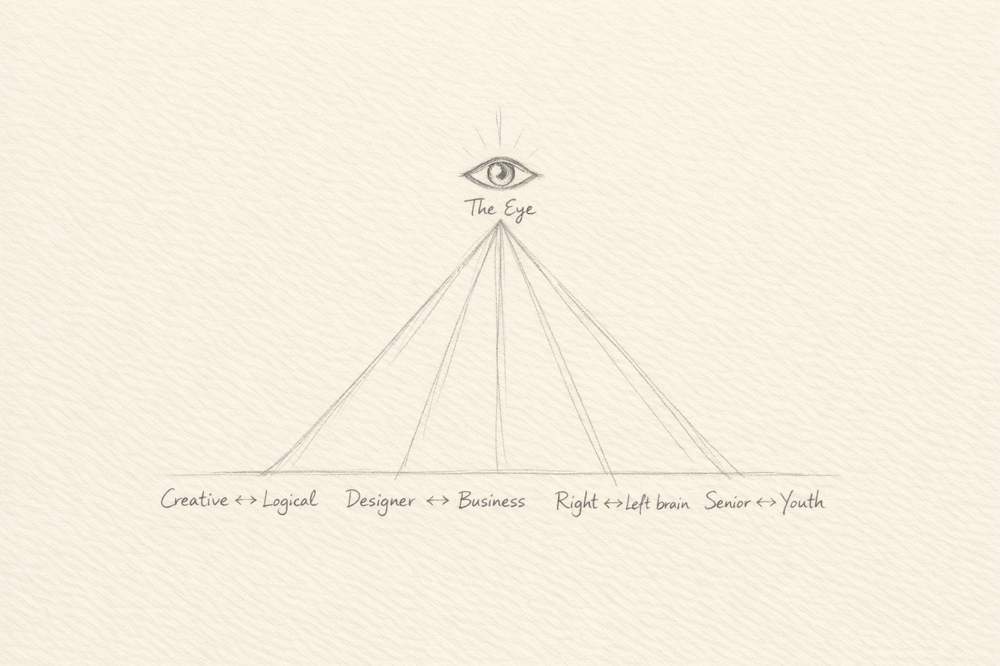
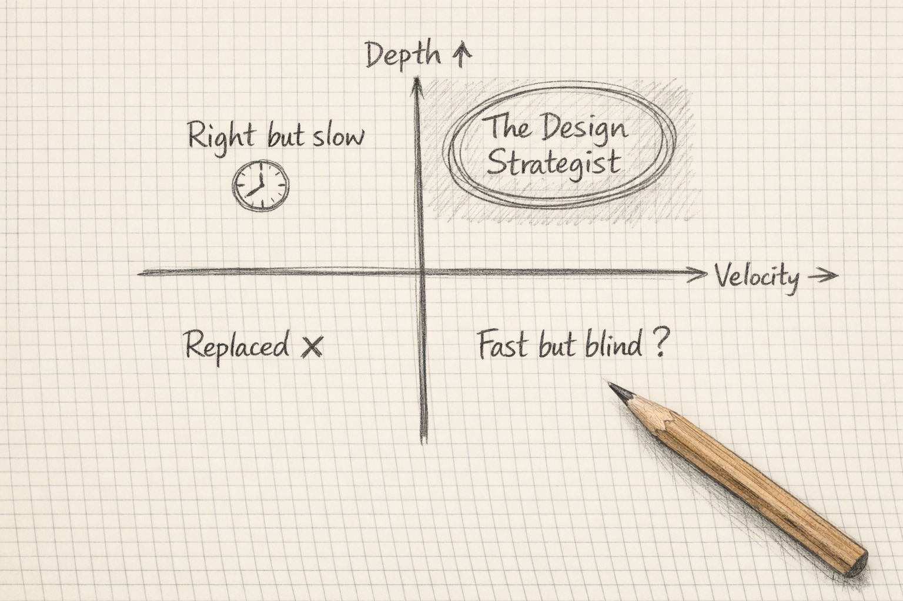

# The Redesign of Design Strategy — An Essential Theory for the Generative AI Era

   

---

# Chapter 1: The Same Eye, a Different World

## What I Found After Crossing Two Worlds

My career began at Future Architect (now Future Corporation), a company with a unique vision: "Designing Management and IT." It was a one-of-a-kind firm that devised technology-driven IT strategies for enterprises and saw them through to full implementation.

As an IT consultant, I learned to read and write code, design system architectures spanning hardware to application layers, and formulate corporate strategy grounded in cutting-edge technology. I built my track record as a true technology-driven IT consultant — an expert in both business and technology.

For the first five years, I worked as an IT consultant and enterprise systems engineer. Enterprise core systems are old, labyrinthine, and plagued by misalignment between documentation, source code, design, and actual implementation. These are the most demanding business systems: massive business logic, spaghetti code, vendor lock-in that paralyzes the organization. I led projects to replace these legacy core systems.

Throughout this career, the non-negotiable disciplines of business and technology were drilled into me: be logically precise, ensure structural consistency, leave no exception unaddressed. A single bug in a system can cause a critical failure. In business, the ability to construct an airtight logical argument that convinces a client's C-suite was an essential communication skill.

Then, when I was 30 years old, in 2012, a single blog changed my life.

Its author was Kunitake Saso — CEO of BIOTOPE, an innovation consulting firm, and a graduate of the Institute of Design at Illinois Institute of Technology. He was one of the pioneers who brought design thinking to Japan. Back when personal publishing meant blogs, not social media, Saso had left a successful marketing and brand management career at P&G to pursue a Master of Design at IIT. To deepen his own learning, he translated each class into his own words and published lecture content on his blog in near-real time.

Why would someone on a solid business career trajectory go to the United States for a design degree?

At the time, the concept of design thinking had zero penetration in Japan. But Saso was communicating something radical: business strategy and design strategy are not opposites — they reinforce each other.

It may be cliché to say the word now, but isn't "innovation" a domain that pure logical thinking cannot reach? When you pursue correctness to its extreme, what remains is a conclusion that 100% of people agree is correct — and that, by definition, is not innovation.

And yet, design (let me be clear: not art) is a problem-solving discipline. Designers solve client problems through design. From the standpoint of problem-solving, business and design differ only in method — their purpose is the same.

At Recruit — a company that represents Japan, the acquirer of Indeed — I served in business development, successfully scaling new ventures through the 10→100 growth phase. At Eirene University (the only institution of its kind in Japan at the time), I studied the theory and practice of innovation management and design thinking to become a lead practitioner in these fields.

My career began at the intersection of business and technology. From there, I "crossed the border" into design. Today, as a business designer at Sun Asterisk, I support new business development for clients across every industry and business model — operating as a BTC professional who has crossed the boundaries of Business, Technology, and Creative.

And at a certain point, I arrived at a decisive discovery.

## The Discovery: Two Modes of Thinking Were One

Working as an expert in both business and design, I had the opportunity to observe the thinking patterns and behavioral traits of outstanding business professionals and outstanding creative directors. Something felt familiar.

When they receive a client's vague request — "Make it feel more modern" or "Something that resonates with younger generations" — the first thing they do is peel away the surface. What is the real problem behind "modern"? How is the brand perceived in the market, and where are the gaps? Where in user behavior patterns is there a structural disconnect?

They extract the essence, visualize it as a structure, and identify the point where "if you push here, everything moves" — the leverage point.

This was exactly the same thinking process I had learned as an engineer practicing "structuring."

And it was exactly the same process that strategy consultants use when solving management challenges.

Read the context and background beneath surface-level phenomena. Extract the essence. Visualize it as a structure. Then, from a hyper-meta perspective, the leverage point comes into sharp focus.

**Design and business were not separate disciplines. They were different expressions of the same cognitive process: seeing the essence and structuring it.**

Creative directors express it through "visuals and experiences." Strategy consultants express it through "frameworks and recommendations." Engineers express it through "architecture and code."

The expressions differ, but the underlying "eye" — the eye that sees the essence and structures it — is the same.

   
  <em>Figure 1-1: Three Expressions, One Eye</em>

## Why This Discovery Matters

This discovery is not merely an intellectual curiosity. In 2026, it has become a matter of survival.

Generative AI has arrived, and the value of "execution" is structurally collapsing. A UI design can be generated in 30 seconds. A landing page draft can be produced in seconds. AI can write 80% of the code. A presentation draft can be completed in minutes.

After execution is taken away, what remains?

Only this "eye."

The ability to see the essence, structure it, and define "what problem should be solved." AI has not yet acquired this lens. AI operates through pattern matching and optimization — it can "solve" problems but cannot "find" them. Extracting the essence from the surface and structuring it — this cognitive mode is a fundamentally different intellectual activity from analysis or optimization.

## The Lens of This Book

This book answers the following question.

Over 20 years, design was elevated from "aesthetics" to a management agenda. The very design firms that drove that ascent paradoxically declined. And now, generative AI is forcing a second, more fundamental redefinition of design.

In the midst of this upheaval, what dies and what survives?

The lens that leads to the answer is the discovery stated at the beginning — "the eye that sees the essence and structures it." Through this eye, 20 years of design history reads as a coherent structure. The rise and fall of design firms, the shock of generative AI, and the value that remains for humans in the AI era — all can be understood as different cross-sections of the same structure.

From the next chapter onward, we put on this lens and read the structural changes that have occurred in the world of design.

### Chapter 1 References

- Future Corporation. https://www.future.co.jp/en/architect/
- Kunitake Saso, "The Intersection of Business and Design" (blog). https://idllife.blogspot.com/
- Kunitake Saso, *Vision Driven: A Thinking Method That Connects Intuition and Logic*, Diamond, Inc., 2019. https://amzn.asia/d/02peSrIJ
- Institute of Design, Illinois Institute of Technology (IIT). https://id.iit.edu/
- Recruit Holdings. https://recruit-holdings.com/en/
- Eirene Management School (formerly Eirene University). https://ems.eireneuniversity.org/
- Kinya Tagawa, *Innovation Skill Set: The BTC Talent the World Demands*, Daiwashobo, 2019. https://amzn.asia/d/08FBpFKC

 

---

# Chapter 2: The Era When Design Changed Business

## The Moment the "Eye" Was Brought into Business

Design changed business — this phrasing is not quite right. More precisely, **there were people who brought into the world of business the "eye" that it had been missing, imported from the domain of design.**

In 1999, ABC Nightline aired "Deep Dive" — a documentary following an IDEO team as they redesigned a shopping cart in five days. After the broadcast, it was said that "dozens of executives called."

What were they responding to?

Not the shopping cart design itself. They responded to the "thinking process" the IDEO team demonstrated. Observe, identify the essential problem, structure it, and give shape to the solution. They intuitively recognized that this process was fundamentally the same as the way they approached their own management challenges.

## The Institutionalization of Design Thinking

Tim Brown's 2008 Harvard Business Review article "Design Thinking" pushed this concept into the business mainstream. He defined design thinking as "a human-centered approach to innovation that draws from the designer's toolkit to integrate the needs of people, the possibilities of technology, and the requirements of business."

That same year, Roger Martin (Dean of the Rotman School of Management, later ranked #1 on Thinkers50) published *The Design of Business*, proposing the "Knowledge Funnel" framework — Mystery → Heuristic → Algorithm.

The institutional foundation was Stanford's d.school (Hasso Plattner Institute of Design). Established in 2005 with a $35 million gift from SAP co-founder Hasso Plattner, d.school explicitly positioned design thinking as "the evolution of design from form and style to thinking and strategy."

Through the lens of Chapter 1, the essence of what was happening here becomes clear. What Tim Brown, Roger Martin, and Stanford d.school did was translate the word "design" into the language of business. The eye that sees the essence and structures it — this capability had always existed in the designer's world. They systematized it into a framework that business professionals could understand and delivered it under the name "design thinking."

## Elevation to a Management Agenda

Companies recognized the value of this "eye" and began incorporating it one after another.

At P&G, A.G. Lafley placed design at the center of transformation upon becoming CEO in 2000. He appointed Claudia Kotchka as P&G's first VP of Design Strategy and Innovation. Over five years, approximately 150 mid-career designers were hired.

At IBM, Phil Gilbert was appointed GM of design in 2012 and changed the designer-to-engineer ratio from 1:72 to 1:8. The number of designers expanded from about 230 to over 3,000. By 2017, more than 90,000 employees had earned the Design Thinking badge. A 2018 Forrester study reported that this approach resulted in 75% faster design and execution and average savings of $20.6 million per engagement.

At PepsiCo, Mauro Porcini became the company's first CDO (Chief Design Officer) in 2012. During his 13-year tenure, PepsiCo's revenue grew 40% and its stock price tripled. In 2025, Porcini was appointed as Samsung's first CDO.

In October 2018, McKinsey published "The Business Value of Design" — a report tracking 300 public companies over five years, quantitatively proving that companies with high design maturity outperformed industry averages by 32 percentage points in revenue growth and 56 percentage points in total returns to shareholders. Design was elevated from "nice to have" to "management imperative."

The UK Design Council's Design Economy 2022 report showed that the design economy contributed 4.9% of UK GVA — £97.4 billion — growing 73% since 2010, at twice the pace of the overall UK economy.

In Japan, the Ministry of Economy, Trade and Industry (METI) and the Japan Patent Office published the "Design-Driven Management" declaration in May 2018, explicitly calling for chief design officers on management teams and for design to be involved from the very beginning of business strategy.

## But a Paradox Lurked Here

The more the value of design rose, the more design firms should have thrived.

The reality was the opposite.

In the next chapter, we unravel the structure of this paradox. Through the lens of Chapter 1, the reason why "the rise of design's value" and "the decline of design firms" happened simultaneously becomes visible.

### Chapter 2 References

- ABC Nightline, "The Deep Dive," 1999. https://www.youtube.com/results?search_query=IDEO+deep+dive+ABC+nightline+1999
- Tim Brown, "Design Thinking," *Harvard Business Review*, June 2008. https://hbr.org/2008/06/design-thinking
- Tim Brown, *Change by Design*, HarperBusiness, 2009. https://www.harpercollins.com/products/change-by-design-revised-and-updated-tim-brown
- Roger Martin, *The Design of Business: Why Design Thinking is the Next Competitive Advantage*, Harvard Business Press, 2009. https://rogerlmartin.com/lets-read/the-design-of-business
- Stanford d.school (Hasso Plattner Institute of Design). https://dschool.stanford.edu/
- Forrester, "The Total Economic Impact of IBM's Design Thinking Practice," 2018. https://www.ibm.com/design/thinking/static/media/Enterprise-Design-Thinking-Report.8ab1e9e1.pdf
- McKinsey & Company, "The Business Value of Design," October 2018. https://www.mckinsey.com/capabilities/mckinsey-design/our-insights/the-business-value-of-design
- Design Council, "Design Economy 2022." https://www.designcouncil.org.uk/our-research/design-economy/
- DMI Design Value Index. https://www.dmi.org/page/DesignValue
- METI & Japan Patent Office, "Design-Driven Management Declaration," May 23, 2018. https://www.meti.go.jp/press/2018/05/20180523002/20180523002.html

 

---

# Chapter 3: The Paradox — Design's Value Rose, Design Firms Died

## The Collapse of IDEO

By tracing the trajectory of IDEO — design thinking's greatest evangelist — the structure of this paradox comes into sharpest focus.

At its peak in 2019–2020, IDEO had approximately 725 employees and roughly $300 million in revenue.

In 2019, Tim Brown stepped down as CEO. Sandy Speicher became the first female CEO. In 2020, the first layoffs — 8% of global staff, approximately 58 people. In 2022, Speicher departed and Derek Robson (a marketing and advertising industry veteran, IDEO's first non-designer CEO) took over. In October 2023, an additional 125 layoffs — 25% of the remaining ~500 people. The Munich and Tokyo offices were closed. Revenue had fallen to approximately $100 million. One-third of its peak.

In April 2025, Michael Peng — a former IDEO partner and co-founder of IDEO Tokyo — was appointed as the new CEO. A designer returned to the top, but headcount is estimated at under 400.

IDEO was not alone. According to John Maeda's Design in Tech Report (2017), more than 70 design firms had been acquired since 2004, with approximately 50% concentrated in 2015–2016. In 2017 alone, consulting firms spent a combined $1.2 billion acquiring design agencies — a 134% increase from the prior year.

   
  <em>Figure 3-1: The Value of Design vs. Design Firm Revenue — The Structure of the Paradox</em>

## Why They Died — Seen Through the Lens

The lens from Chapter 1 makes the structure of this collapse legible.

Design firms were selling two things. One was "the eye that sees the essence and structures it." The other was "a package of methods" — design thinking workshops, research methodologies, prototyping processes.

Of these, the "package of methods" was destined to become a commodity. The moment d.school systematized it into an educational program and it spread worldwide through books and online courses, the exclusive value of the method evaporated.

Meanwhile, the "eye" belongs to individuals. It does not belong to organizations.

Companies realized this. Rather than hiring an external design firm to borrow the "eye," it was more rational to hire individuals who possessed the "eye" directly. IBM's expansion from 230 to over 3,000 in-house designers was the logical consequence of this structure. Capital One came to employ over 450 designers internally. The acquisition of Adaptive Path was driven by the same logic.

Natasha Jen (partner at Pentagram) stated in her 2017 talk "Design Thinking is Bullshit" that design thinking "oversimplifies a nuanced, messy process into manufactured, sanitized steps." What she was pointing to was precisely this: the "eye" cannot be reduced to sanitized steps. But the design firm business model depended on reducing the "eye" to "methods" and selling them.

This is the anatomy of the paradox. **Precisely because design's value was elevated to a management agenda, companies sought to acquire the "eye" directly, and design firms that only sold "packages of methods" became unnecessary.**

### Figure 3-2: The "Eye" vs. "Package of Methods" — Why Design Firms Died

|  | Package of Methods | The Eye (Cognition That Sees Essence and Structures It) |
|---|---|---|
| **Belongs to** | Organizations / Frameworks | Individuals |
| **Commoditization** | Inevitable (spread worldwide via d.school, books, online courses) | Does not commoditize (a cognitive mode that resists formalization) |
| **Transferability** | High (teachable through workshops) | Low (acquired only through experience and boundary-crossing) |
| **How design firms sold it** | Cut and sold as packages | Rented out by the person-month |
| **Companies' rational response** | Reproducible internally → no need to outsource | Hire people with the "eye" directly → in-house |
| **Result** | Design firms' reason for existence disappeared | IBM 3,000+, Capital One 450+ designers in-house |

## The Common Structure of the Survivors

While more than 70 design firms were acquired and absorbed, some survived — and even grew. Their common structure confirms the validity of the Chapter 1 lens.

**McKinsey Design × QuantumBlack.** Beginning with the acquisition of LUNAR in 2015, McKinsey built a design organization of approximately 350 people. The critical factor is not design alone but its integration with QuantumBlack (the AI and data science division). They deliver the "eye" of design, the "execution power" of AI and data, and the "frameworks" of strategy consulting as a trinity. They are not selling methods. They are selling integrated problem-solving capability that includes the "eye."

**Accenture Song.** Through the acquisition of over 40 agencies including Fjord (2013) and Droga5 (2019), Accenture built a $20 billion empire. It surpassed WPP ($14.7 billion) and Publicis ($16 billion) to become the world's largest creative organization. Yet in September 2025, Song was absorbed into the new integrated unit "Reinvention Services." Accenture invested $3 billion in AI and delivered AI training to 550,000 employees. Promotion now requires regular use of AI. Here too, design survives not on its own but as an integrated offering of technology × creative × data.

**frog → Capgemini Invent.** Through Capgemini's €3.6 billion acquisition of Altran, frog was integrated and expanded from approximately 500 to over 2,000 people. As "frog, part of Capgemini Invent," it positions itself as end-to-end — from strategy through design to implementation.

In Japan, **Takram** established "Pendulum Thinking" — a methodology integrating business, technology, and creative — and handles major projects such as Toyota's Lunar Cruiser UX/HMI design, Osaka Expo pavilions, and Panasonic VISION UX. **Goodpatch** became Japan's first design company to IPO in 2020 and, in 2025, made Layermate (an AI design tool company) a subsidiary to enter the AI design space in earnest.

The common structure of the survivors is clear. **Only organizations that delivered "the totality of problem-solving" — integrating the "eye" with technology, data, and AI — rather than cutting and selling the "eye" as a package of methods, survived.**

And to this structure, a decisive new variable was introduced between 2024 and 2026.

### Chapter 3 References

- George Aye, "Surviving IDEO," *Medium*, May 2021. https://medium.com/@georgeaye/surviving-ideo-8ac5ca5c46a8
- John Maeda, "Design in Tech Report 2017." https://designintech.report/
- Natasha Jen, "Design Thinking is Bullshit," 99U Conference, 2017. https://99u.adobe.com/videos/55967/natasha-jen-design-thinking-is-bullshit
- Bruce Nussbaum, "Design Thinking Is A Failed Experiment. So What's Next?," *Fast Company*, 2011. https://www.fastcompany.com/1663558/design-thinking-is-a-failed-experiment-so-whats-next
- McKinsey Design. https://www.mckinsey.com/capabilities/mckinsey-design/how-we-help-clients
- QuantumBlack (McKinsey). https://www.mckinsey.com/capabilities/quantumblack/how-we-help-clients
- Accenture Song / Reinvention Services. https://www.accenture.com/us-en/services/song-index
- frog / Capgemini Invent. https://www.frog.co/
- Takram. https://www.takram.com/
- Goodpatch. https://goodpatch.com/
- Goodpatch, Layermate subsidiary press release, October 2025. https://goodpatch.com/news

 

---

# Chapter 4: What Generative AI Took, and What It Could Not

## The Collapse of Execution's Value

The changes that occurred in design's "execution" layer between 2024 and 2026 are structural and irreversible.

Adobe Firefly had generated 24 billion assets by May 2025 — up 24× from 1 billion in June 2023. 75% of Fortune 500 companies use it.

Midjourney has approximately 21 million registered users and estimated revenue of $500 million (2025). With only 100–163 employees and zero external funding, it grew 900% from $50 million in 2022.

Figma announced Make Designs (text-to-UI) at Config 2024 and rapidly followed up in 2025 with Figma Make (prompt-to-code prototyping), Figma Sites (design-to-website publishing), and Figma Buzz (AI-driven brand asset creation).

The compression of workflows is striking. Landing page drafts went from hours to under 30 seconds. Iteration cycles went from 2–4 weeks to the next day. McKinsey reports that product development time can be reduced by 30–50%.

### Figure 4-1: The Collapse of Execution's Value — Design Workflow Compression

| Design Phase | Pre-AI | Post-AI | Compression |
|---|---|---|---|
| Landing page draft | Hours | Under 30 seconds | **~99%** |
| Design discovery | 1–3 weeks | Under 1 week | ~60–70% |
| Initial prototype | 2–4 weeks | ~1 week | ~65–75% |
| Iteration cycle | 2–4 weeks | Next day | **~80%** |
| Overall product development | 12–18 months | 30–50% reduction | 30–50% |

*Sources: McKinsey Global Institute (2023), BCG/Harvard Business School (2023), industry data*

As a result, UX designer job postings declined 71% from their 2022 peak. UX researcher postings fell 73%. By 2025, 21% of companies had laid off UX staff.

## What Was Taken, What Could Not Be Taken

Through the lens of Chapter 1, the structure of what is happening here becomes visible.

**What was taken is "execution."** UI design, prototyping, writing, early-stage research — these are domains that can be accelerated and automated through a combination of pattern matching and generation, where AI excels. In Nigel Cross's terms, they belong to the layer that can be processed by "algorithm."

**What could not be taken is the "eye."**

   
  <em>Figure 4-2: What Was Taken / What Could Not Be Taken</em>

Here, it must be noted how remarkably accurately the intellectual heritage of design theory predicted this structure.

In his 1982 paper "Designerly Ways of Knowing," Nigel Cross argued that design constitutes a "third area of education" alongside science and the humanities. Where science studies the natural world through analysis and objectivity, and humanities study human experience through analogy and criticism, design studies the artificial world through "modeling, pattern formation, and synthesis." And this designerly cognition is "an essential aspect of human intelligence."

In contrast to Herbert Simon's attempt to create a "science of design," Cross clearly argued back: "The act of designing itself is not and will not be a scientific activity."

Donald Schön's *The Reflective Practitioner* (1983) identified the core activity of design as "reflection-in-action" — "When someone reflects in action, he becomes a researcher in the practice context. He does not depend on the categories of established theory and technique, but constructs a new theory of the unique case."

Kees Dorst's (Princeton University professor) *Frame Innovation* (2015) argued that design's most valuable contribution is "frame creation" — the ability to create new approaches to the problem situation itself. His signature case is emblematic: reframing late-night crime and congestion in a nightclub district not as a policing problem but through the lens of a "music festival." This conceptual leap would never emerge from an analytical approach alone.

What this intellectual heritage points to is the same thing described as the "eye" in Chapter 1. The ability to extract essence from the surface, structure it, and redefine the problem itself. Cross's "designerly ways of knowing," Schön's "reflection-in-action," Dorst's "frame creation" — the names differ, but they all refer to the same cognitive mode.

AI systems operate through algorithmic processing of defined inputs to defined outputs. Pattern matching and optimization. As Schön's framework revealed, expert practice operates in "a fundamentally different mode that resists formalization."

Yann LeCun (Meta Chief AI Scientist) has stated: "AI systems are still very far from the kind of common sense that humans possess." Don Norman has declared: "AI is powerful but not intelligent. It is a pattern-matching device."

Yet what deserves attention is Nielsen Norman Group's 2025 analysis: UX professionals represent less than 0.01% of the US workforce but generate 7.5% of all Claude conversations — making them a top-5 profession by AI conversation volume. Autodesk's 2025 AI Jobs Report found that design skills surpassed coding, cloud, and other technical competencies as the most in-demand skill in AI-related job postings.

Execution was taken, yet demand did not disappear. It moved upstream.

Those who possess the "eye" accelerate execution with AI — this structure is becoming the essential form of design in the AI era.

### Chapter 4 References

- Adobe Firefly. https://www.adobe.com/products/firefly.html
- Midjourney. https://www.midjourney.com/
- Figma AI / Figma Make / Figma Sites / Figma Buzz. https://www.figma.com/
- McKinsey Global Institute, "The economic potential of generative AI," 2023. https://www.mckinsey.com/capabilities/mckinsey-digital/our-insights/the-economic-potential-of-generative-ai-the-next-productivity-frontier
- BCG / Harvard Business School, "Navigating the Jagged Technological Frontier," September 2023. https://www.hbs.edu/faculty/Pages/item.aspx?num=64700
- HBR, "AI layoff analysis" (survey of 1,006 executives), January 2026. https://hbr.org/
- Nigel Cross, "Designerly Ways of Knowing," *Design Studies*, Vol. 3, No. 4, 1982. https://doi.org/10.1016/0142-694X(82)90040-0
- Herbert Simon, *The Sciences of the Artificial*, MIT Press, 1969. https://mitpress.mit.edu/9780262691918/the-sciences-of-the-artificial/
- Donald Schön, *The Reflective Practitioner: How Professionals Think in Action*, Basic Books, 1983. https://www.hachettebookgroup.com/titles/donald-a-schon/the-reflective-practitioner/9780465068784/
- Kees Dorst, *Frame Innovation: Create New Thinking by Design*, MIT Press, 2015. https://mitpress.mit.edu/9780262324311/frame-innovation/
- Horst Rittel & Melvin Webber, "Dilemmas in a General Theory of Planning," *Policy Sciences*, Vol. 4, 1973. https://doi.org/10.1007/BF01405730
- Yann LeCun, Meta Chief AI Scientist, public statements on AI limitations, 2025. https://x.com/ylecun
- Don Norman, public statements on AI and design, 2025. https://jnd.org/
- Nielsen Norman Group, "How UX Professionals Use AI," 2025. https://www.nngroup.com/
- Autodesk, "AI Jobs Report 2025." https://www.autodesk.com/

 

---

# Chapter 5: The Collapse of Binary Oppositions — Where Design and Business Become One

## False Boundaries

So far, we have used the lens handed to you in Chapter 1 — "the eye that sees the essence and structures it" — to read 20 years of design history.

In Chapter 2, we saw how this "eye" was brought into the world of business. In Chapter 3, we saw the structure in which design firms that cut and sold the "eye" as a package of methods died, while organizations that integrated the "eye" holistically survived. In Chapter 4, we saw the structure in which generative AI took "execution" and only the "eye" remained.

All of these point to a single destination.

**"Creative vs. logical." "Designer vs. business professional." "Right brain vs. left brain." — These binary oppositions were all false boundaries.**

This chapter unravels that structure.

## At the Summit, They Become One

Let me restate, with greater precision, the decisive discovery I made through crossing boundaries.

When outstanding creative directors solve a problem, they first peel away the surface. The client's words, user behavior, market trends — they read the context and background beneath these surface-level phenomena. From there, they extract the essence and visualize it as a structure. Then, from a hyper-meta perspective, the leverage point becomes sharply clear.

When outstanding strategy consultants solve a management challenge, they do exactly the same thing. Financial data, competitive dynamics, organizational power structures — they read the context and background beneath these surface-level phenomena, extract the essence, visualize it as a structure, and identify the leverage point.

When outstanding software architects design a system, they do exactly the same thing. They peel away the surface of requirements, extract the essence of the domain, visualize it as a structure, and identify the design decision with the greatest impact.

The expressions differ. Creative directors express through visuals and experiences. Strategy consultants express through frameworks and recommendations. Architects express through blueprints and code.

But the cognitive process at the core is identical.

This is not a coincidence. What Nigel Cross called "designerly ways of knowing" — modeling, pattern formation, synthesis — was never the exclusive property of designers. It was the common cognitive mode that experts in every field arrive at when they reach the summit of dealing with complex problems.

"Design thinking" became a management agenda not because the method was superior. It was because the world of business lacked a language for this cognitive mode. The design world had one. So it was named "design thinking." But in essence, it was not "design" thinking — it was thinking "at the summit of problem-solving."

   
  <em>Figure 5-1: The Convergence of Binary Oppositions — Divergent at the Surface, One at the Summit</em>

## Design Is Not Art

A fundamental misconception must be corrected here.

For a long time, design has been confused with art. Making beautiful things, expressing through sensibility, following intuition. This misconception gave birth to the "creative vs. logical" binary opposition.

But art and design are fundamentally different.

Art is self-expression. The act of projecting one's inner world outward. The criteria for evaluation are subjective, and no "correct answer" exists.

Design is problem-solving. The act of presenting a structural solution to an external problem. The criterion for evaluation is "whether the problem was solved," and a clear "better or worse" exists.

Understanding this distinction reveals just how superficial the "right brain vs. left brain" classification is. If design is problem-solving, then it does not oppose logical thinking — it is merely a different expression of the same intellectual activity directed at the same purpose (solving problems).

Roger Martin's Knowledge Funnel — Mystery → Heuristic → Algorithm — provides theoretical backing for this integration. Designers excel at the transformation from Mystery (the ambiguous problem space) to Heuristic (rules of thumb). Business professionals excel at the transformation from Heuristic to Algorithm (reproducible process). But excellent problem-solvers move freely across all stages of the funnel.

**At the summit, the boundary disappears.**

## The Collapse of Binary Oppositions as a Meta-Theme

This discovery does not stop at the relationship between design and business.

"Senior vs. junior" — In the AI era, accumulated experience directly determines the quality of AI output, giving senior professionals a structural advantage. But younger professionals, precisely because they have no filters, can complement the blind spots of seniors. The boundary between teacher and student collapses into a bidirectional complementary relationship.

"Proprietary vs. open-weight" — In spring 2026, open-weight LLMs caught up to frontier model performance. The boundary between cloud and edge collapses, and inference moves to the device.

"Execution vs. strategy" — The moment generative AI took execution, the boundary between executor and strategist collapsed. Those with the "eye" accelerate execution with AI. Executors without the "eye" are replaced by AI.

Every binary opposition converges at the summit. This is the structural characteristic of the year 2026.

### Chapter 5 References

- Nigel Cross, "Designerly Ways of Knowing," *Design Studies*, Vol. 3, No. 4, 1982. https://doi.org/10.1016/0142-694X(82)90040-0
- Roger Martin, *The Design of Business: Why Design Thinking is the Next Competitive Advantage*, Harvard Business Press, 2009. https://rogerlmartin.com/lets-read/the-design-of-business
- Satoshi Yamauchi, "What They Won't Teach You — What the AI-Advantaged Generation Won't Teach You About How to Use AI and the OS of Thinking." https://github.com/Leading-AI-IO/what-they-wont-teach-you
- Satoshi Yamauchi, "The Edge of Intelligence — When AI Runs on Your Device." https://github.com/Leading-AI-IO/edge-ai-intelligence

 

---

# Chapter 6: The Design Strategist of the AI Era

## The Era of Those Who Possess the "Eye"

So far, we have tested the hypothesis presented in Chapter 1 — "design and business are different expressions of the same cognitive process" — through 20 years of design history and the structural changes brought by generative AI.

The conclusion is clear. **The only value that survives the AI era is "the eye that sees the essence and structures it" — and the ability to define "what should be solved" through that eye.**

So how does one sharpen the "eye"? And how should those who possess it operate in the AI era?

## How to Sharpen the "Eye"

The "eye" is not a talent. It is a reproducible pattern of thinking.

The steps can be explicitly described.

**First, peel away the surface.** Everything — every phenomenon, every situation — has context, background, and intent. Ask what lies beneath what is visible. When a client says "make it more modern," what is the real problem behind "modern"? When revenue declines, what structural factor lies behind the numbers? Consciously practice this act of "peeling."

**Second, extract the essence.** The essence is the mechanism or structure that gives rise to the phenomenon. Often, a single common structure lurks beneath multiple surface-level events. Find it.

**Third, visualize it as a structure.** Express the extracted essence in a form others can understand — a diagram, a framework, a model, a prototype. This act of "visualization" is design, is business, is architecture. Only the expression differs; the essence of the act is the same.

**Fourth, identify the leverage point.** From the structuralized model, a hyper-meta perspective brings the point where "if you push here, everything moves" into sharp focus. This is Dorst's "frame creation," the strategy consultant's "critical success factor," and the architect's "design decision."

These four steps can be applied by designers, business professionals, and engineers alike, regardless of domain. Because this is not a methodology specific to any field — it is a universal cognitive process for confronting complex problems.

## Practicing Design Strategy in the AI Era

When someone who possesses the "eye" arms themselves with AI, what happens?

In June 2025, Stanford d.school published "Why AI Makes Design Skills More Valuable Than Ever" in partnership with Stanford HAI. The report argued that current AI literacy is too heavily skewed toward tool proficiency, and that what truly matters is not generation itself but the "before" (direction-setting, framing the question) and the "after" (editing, curating, remixing).

"Before" and "after" — this is precisely the function of the "eye." Define "what should be solved" (before), and from what AI has generated, discern the essence and restructure it (after).

Jakob Nielsen has stated: "Designers gain '2× productivity' by not focusing on low-level tasks. They need to work at a higher level, think about higher-order design problems. That is precisely what AI cannot do."

In practical terms, the daily routine of a design strategist in the AI era looks like this.

Delegate early-stage research to AI. Have it read and summarize 100 competitive analyses. Generate 10 UI patterns. Write 50 variations of copy.

But deciding "which problem should be solved" is not AI's job. Judging "what to read from 100 competitive analyses" is not AI's job. Structurally explaining "why this is the right one out of 10 UI patterns" is not AI's job.

This is Depth & Velocity. Depth is the depth of the "eye," and Velocity is those who possess the "eye" accelerating execution with AI. However, I do not claim that D&V is the complete answer. D&V is a practical methodology; the core message of this book — "the eye that sees the essence and structures it is the only weapon that survives the AI era" — is the philosophical foundation.

   
  <em>Figure 6-2: Depth × Velocity — The Position of the Design Strategist in the AI Era</em>

## The Place of Technology

One important note to close with.

This book has stated that "business and design are different expressions of the same cognitive process." What about technology?

Technology is "the means of implementing structure," and it differs in nature from business and creative. Both business and creative belong to the cognitive domain of "what should be solved" and "how to structure it." Technology belongs to the domain of "implementing what has been structured into reality."

This is precisely why the scarcity of BTC talent — those who cross the boundaries of Business, Technology, and Creative — is so extreme. Human beings who can move between the domain of the "eye" (B and C) and the domain of "implementation" (T) are exceedingly rare in this world.

In the AI era, the implementation power of technology is accelerated by AI. But the "eye" that decides "what to implement" belongs only to humans.

### Chapter 6 References

- Stanford d.school & Stanford HAI, "Why AI Makes Design Skills More Valuable Than Ever," June 2025. https://dschool.stanford.edu/
- Jakob Nielsen, "No More User Interface?," 2025. https://www.nngroup.com/
- Nielsen Norman Group, "The Future-Proof Designer," June 2025. https://www.nngroup.com/
- Autodesk, "AI Jobs Report 2025." https://www.autodesk.com/
- IEEE, "AI-Augmented Design Thinking," peer-reviewed paper, 2024. https://ieeexplore.ieee.org/
- State of AI in Design Report 2025. https://stateofaiindesign.com/
- John Maeda, "Design in Tech Report 2025" (11th edition), SXSW 2025. https://designintech.report/
- Kees Dorst, *Frame Innovation: Create New Thinking by Design*, MIT Press, 2015. https://mitpress.mit.edu/9780262324311/frame-innovation/
- Satoshi Yamauchi, "Depth & Velocity — A Practical Methodology for New Business Development in the Generative AI Era." https://github.com/Leading-AI-IO/depth-and-velocity
- Kinya Tagawa, *Innovation Skill Set: The BTC Talent the World Demands*, Daiwashobo, 2019. https://amzn.asia/d/08FBpFKC

 

---

# Afterword

The value of design has shifted irreversibly from execution to cognition.

McKinsey MDI (32-point revenue growth outperformance), the UK Design Economy (£97.4 billion GVA), and the 73.8% improvement rate among Japanese companies that adopted design-driven management prove design's economic impact. But IDEO's simultaneous collapse ($300 million → $100 million) and the acquisition of more than 70 design firms prove that there is no longer value in "producing" design deliverables.

Generative AI has accelerated this split to its extreme.

What remains — and what this book wants to convey to the reader — is one thing only.

**The eye that sees the essence and structures it.**

This does not belong to designers alone. It is open to business professionals, to engineers, to every problem-solver. The expressions may differ, but the "eye" is the same.

Design and business are not separate disciplines. The worlds you thought were separate were, in fact, the same place all along.

I hope this discovery changes your "eye."

---

© 2026 Satoshi Yamauchi — Leading AI (Leading AI LLC)
This book is published under the CC BY 4.0 license.
https://github.com/Leading-AI-IO
